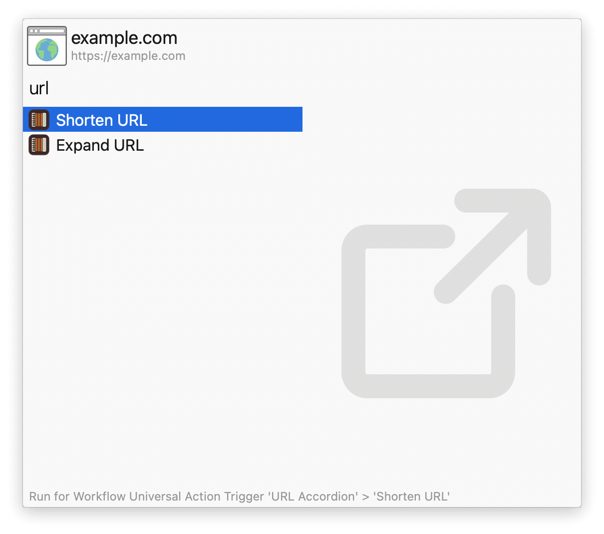

#  URL Accordion Alfred Workflow

Shorten and expand URLs

[⤓ Install on the Alfred Gallery](https://alfred.app/workflows/alfredapp/url-accordion)

## Usage

Shorten and expand URLs via the  `shorturl` and `longurl` keywords.

* <kbd>↩&#xFE0E;</kbd> Copy result to clipboard.
* <kbd>⌘</kbd><kbd>↩&#xFE0E;</kbd> Copy result and paste to frontmost app.

Alternatively, use the [Universal Actions](https://www.alfredapp.com/help/features/universal-actions/).

